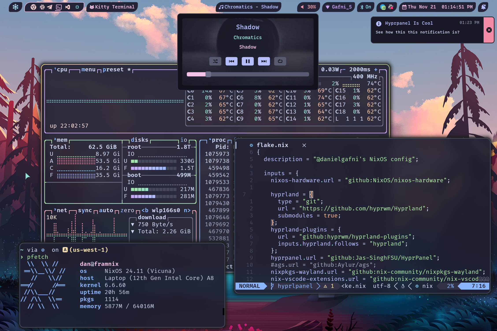

# NixOS Config

My NixOS configuration featuring multi-host setup, a few GitHub Actions, remote caching, pre-commit hooks & CI, and [Catppuccin](https://catppuccin.com/) theme for all programs. 

Key specs:

- `home-manager` for user configuration
- `hyprland` as Wayland compositor & window manager
- `eww` for status bar amd some widgets
- `catppuccin` theme for everything



> [!WARNING]  
> WIP, not documented

## Usage

### Installation

prerequisites: `nix`

The repo contains a helper `justfile` to assist with common NixOS management tasks.
`just` and `nom` commands are required to use it. They can be installed with `Nix` in case they are missing:

```shell
nix-shell -p just nix-output-monitor
```

To test a new NixOS build, run:

```shell
just nixos-rebuild <host>
```

This will download, build and install **system** packages and configurations.

To make the build permanent, add `mode=switch`:

```shell
just mode=switch nixos-rebuild <host>
```

This will add a new boot record to the bootloader.

Files in `$HOME` are defined via `Home Manager`, which can be invoked separately:

```shell
just home <host> switch
```

## Notes

### Fonts

| Purpose | Name | Comment |
|----------|----------|-------|
| Code    | Fira Code Nerd Font | |
| UI    | Cabin   | Easy on eyes, good default |
| UI    | Recursive  | Eye candy, catchy |

### Debugging mime-type

```shell
XDG_UTILS_DEBUG_LEVEL=2 xdg-mime query filetype foo.pdf

XDG_UTILS_DEBUG_LEVEL=2 xdg-mime query default application/pdf

fd evince.desktop /
```
