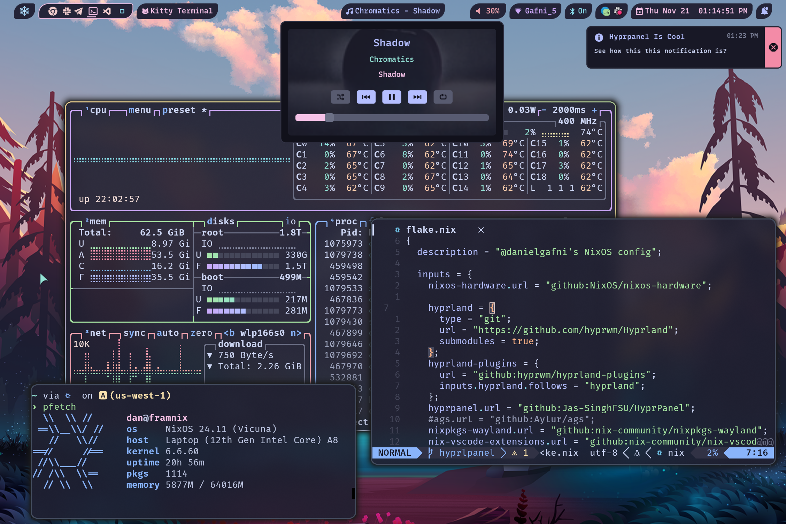

# NixOS Config

My NixOS configuration with multi-host setup, a few GitHub Actions, [personal build cache](https://danielgafni.cachix.org/), checks via pre-commit hooks & CI, and [Catppuccin](https://catppuccin.com/) theme for all programs.

## Overview

This repo uses the [Dendritic Nix pattern](https://github.com/mightyiam/dendritic) with the [Den framework](https://den.oeiuwq.com/) to configure multiple hosts, OSes (NixOS and MacOS) and users while shaing most of the codebase between these targets.

Packages are cached in CI so local installations are faster (this is critical for nightly Zed builds from the flake which take 40+ min).

Key components:

- [NixOS](https://nixos.org/) for system configuration on Linux
- [nix-darwin]() for system configuration on MacOS
- [Home Manager](https://github.com/nix-community/home-manager) for user configuration. Most user-space programs are installed and configured via Home Manager.
- [sops-nix](https://github.com/Mic92/sops-nix) for storing secrets securely.
- [YubiKey](https://www.yubico.com/) for SSH and GPG (and `sops-nix`). It makes life easier and more secure.
- [Ghostty](https://mitchellh.com/ghostty) - an amazing modern cross-platform terminal emulator. Very performant, has a lot of features and super good defaults.
- [Catppuccin](https://catppuccin.com/) theme for everything - because it's beautiful, easy on eyes, and has an implementation for every app in the world. It's automatically applied to all programs via [cattppuccin/nix](https://github.com/catppuccin/nix).
- [Starship](https://starship.rs/) terminal prompt. Nothing can beat it in terms of speed, features, and looks.
- [Zed](https://github.com/zed-industries/zed) editor setup with a bunch of language servers and plugins. Zed is the future. The GOAT Python LSs are configured for Zed: `ruff` and `basedpyright`.

### Linux 

- [Hyprland](https://hyprland.org/) as Wayland compositor & window manager. It's very fast, looks amazing, and has a lot of features. Now has a huge community and is finally stable!
- [Hyprpanel](https://hyprpanel.com/) a panel, widgets, and notifications for Hyprland. Has very good defaults and doesn't require much configuration.
- [Vicinae](https://github.com/vicinaehq/vicinae) a feature-rich, fast, user-friendly launcher compatible with the Raycast plugin ecosystem



## Usage

### Prerequisites

- [NixOS](https://nixos.org/download/) or just [nix](https://nix.dev/install-nix.html) (only `$HOME` setup)
- [nh](https://github.com/viperML/nh) - an excellent Nix helper. It has a better UX and the output is more informative.

### Installation

```shell
nh os switch
```

This will download, build and install **system** packages, files and configurations.

> [!NOTE]
> Use `nh os test` to test configurations without adding boot entries.

```shell
nh home switch
```

This will download, build and install **user** packages, files and configurations.

## Architecture

This repo uses the [Dendritic Nix pattern](https://github.com/mightyiam/dendritic) with the [Den framework](https://den.oeiuwq.com/). Configuration is organized by **concern** into *aspects*.

This allows elegantly composing and mixing aspects into configurations for NixOS, Darwin (MacOS), different users and hosts, while sharing everything what can be shared between them.

### Aspects (`modules/aspects/`)

An aspect is an attrset containing modules for different Nix classes (`nixos`, `darwin`, `homeManager`). Aspects compose via `includes` to form a DAG.

- **`features/`** - Reusable concerns: shell, editors, desktop, security, CLI tools, platform services
- **`users/`** - Per-user entry points with platform-specific variants under `darwin/` and `linux/`
- **`hosts/`** - Per-host entry points that include feature aspects

## Notes

### Fonts

| Purpose | Name                                                        | Comment                    |
| ------- | ----------------------------------------------------------- | -------------------------- |
| Code    | [Maple Mono NF](https://github.com/subframe7536/maple-font) | Programming                |
| UI      | Cabin                                                       | Easy on eyes, good default |
| UI      | Recursive                                                   | Eye candy, catchy          |

Honorable mention: [Fira Code](https://github.com/tonsky/FiraCode) - an excellent programming font that served me very well for years.

It's necessary to rebuild fonts cache in order to observe live changes after modifying the config:

```shell
fc-cache -rf
```

### Custom modules

`packages/` contains some custom packages. These are:

- `packages/nebius-cli.nix` - [Nebius CLI](https://docs.nebius.com/cli)
- `packages/waystt.nix` - [waystt](https://github.com/sevos/waystt) - Wayland speech-to-text tooling. Press `SUPER+T` to talk, release to type transcribed text via `wtype`. Using `SUPER+SHIFT+T` copies the transcript to clipboard instead.

### Debugging mime-type

```shell
XDG_UTILS_DEBUG_LEVEL=2 xdg-mime query filetype foo.pdf

XDG_UTILS_DEBUG_LEVEL=2 xdg-mime query default application/pdf

fd evince.desktop /
```

### GPG + SSH + YubiKey setup via NixOS

[See this tutorial](https://github.com/danielgafni/YubiKey-Guide?tab=readme-ov-file#install-software) on building a secure live NixOS image. It can be used to generate a GPG key and transfer it to multiple YubiKeys.
